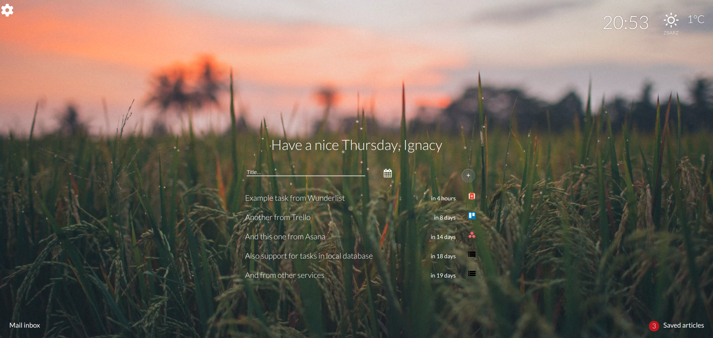

# Orrange New Tab

New tab extension written in React that lets you arrange your tasks from multiple services and be more productive

• Integration with Wunderlist, Todoist, Trello, Google Tasks, Asana and more  
• Manage your mail and calendar events with Gmail and Google Calendar integration  
• Customize your new tab with your favorite background image  
• Remind yourself of your saved articles with Pocket integration.  



 
## Build from source

Fill in all your client IDs from services like Todoist, Wunderlist, Trello etc. in [.env](.env) file and Google client ID in [manifest.json](public/manifest.example.json) (in Cloud Platform enable Gmail API, Tasks API and Calendar API) then run
```bash
npm install
npm run build
```
To build with production environment variables from [.env.production](.env.production) with minified JS files use

```bash
npm run build-production
```
## Related Repos
[orrangenewtab_api_server](https://github.com/lopogo59/orrangenewtab_api_server)
[orrangenewtab_image_server](https://github.com/lopogo59/orrangenewtab_image_server)

## Contributing
Any help is more than welcome as I'm doing this project in my free time. Pull requests are especially welcome. 


## License
[GNU GPLv3](https://choosealicense.com/licenses/gpl-3.0/)